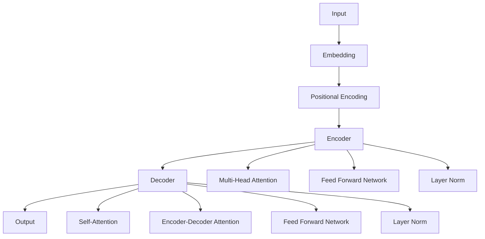

# Transformers Model Implementation

## Overview

This repository contains a PyTorch implementation of the Transformer model, a state-of-the-art neural network architecture for sequence-to-sequence tasks such as machine translation, text summarization, and more. 


The code is inspired by [hyunwoongko/transformer](https://github.com/hyunwoongko/transformer), with additional Chinese comments for better understanding.


Additionally, the code also instantiates the model and outputs the overall architecture for easy understanding.

这个仓库包含了一个基于 PyTorch 的 Transformers 模型实现，这是一种用于序列到序列任务（如机器翻译、文本摘要等）的先进神经网络架构。


代码的灵感来自于 hyunwoongko/transformer，并增加了一些中文注释。此外，代码也对模型进行了实例化，输出了整体架构以方便理解。

## Key Features

- **Multi-Head Attention**: Allows the model to jointly attend to information from different representation subspaces at different positions.
- **Positional Encoding**: Adds positional information to the input embeddings to preserve the order of the sequence.
- **Layer Normalization**: Helps in stabilizing the learning process and allows the model to be trained with higher learning rates.
- **Feed Forward Networks**: Applies a linear transformation followed by a ReLU activation and another linear transformation.
- **Encoder-Decoder Architecture**: Consists of an encoder that encodes the input sequence and a decoder that generates the output sequence.

## Modules Explanation

### TokenEmbedding

- A PyTorch Embedding layer that converts input tokens into dense vector representations.
- Inherits from `torch.nn.Embedding` and adds positional information.

### PositionalEncoding

- Adds a fixed vector to the input embeddings to encode the position of each token in the sequence.
- Uses sine and cosine functions to create the position encodings.

### TransformerEmbedding

- Combines token embeddings with positional encodings.
- Applies dropout to prevent overfitting.

### MultiHeadAttention

- Implements the multi-head attention mechanism.
- Splits the input into multiple heads, applies attention, and then concatenates the results.

### ScaleDotProductAttention

- Computes the attention scores using a scaled dot product.
- Applies a softmax function to obtain the attention weights.

### LayerNorm

- Normalizes the input data for each sample individually.
- Helps in stabilizing the training process.

### PositionWiseFeedForward

- Applies two linear transformations with a ReLU activation in between.
- Used in both the encoder and decoder layers.

### EncoderLayer

- Consists of self-attention, feed-forward networks, and layer normalization.
- Applies dropout for regularization.

### Encoder

- Stacks multiple encoder layers.
- Embeds the input sequence and passes it through the encoder layers.

### DecoderLayer

- Similar to the encoder layer but includes an additional attention mechanism for encoder-decoder attention.
- Also applies dropout for regularization.

### Decoder

- Stacks multiple decoder layers.
- Embeds the target sequence and passes it through the decoder layers.

### TransformerModel

- Combines the encoder and decoder.
- Defines the overall architecture of the Transformer model.

## Getting Started

To use this implementation, simply clone the repository and run the Python script:

```bash
git clone https://github.com/Issac-Sun/Easy_Transformers.git
cd transformer-model
python transformers_model.py
```

## Architecture Overview



This diagram provides a high-level overview of the Transformer model's architecture, showing the flow from input to output through the various components.

## Acknowledgements

This implementation is based on the work of [hyunwoongko/transformer](https://github.com/hyunwoongko/transformer). Special thanks to the original author for their contribution to the open-source community.

## License

This project is licensed under the MIT License - see the [LICENSE](LICENSE) file for details.
